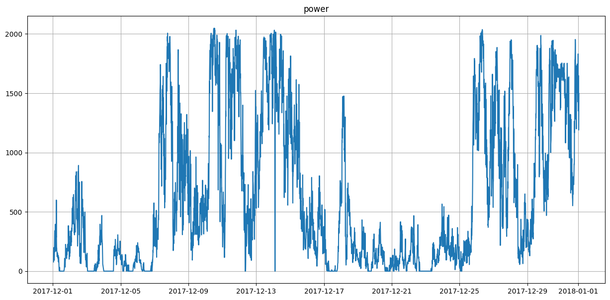
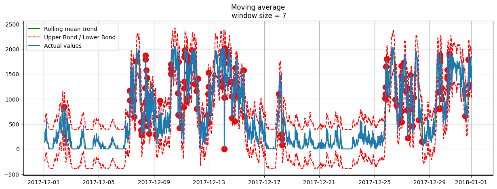

# performance-prediction
Benchmark different methods to predict industrial wind turbines performance as a case study

# Introduction

In this project, we want to predict wind turbines performance in terms of Power and Torch of the motor as a key performance of the turbines. It is a case study of the industrial infrastructure control project and it can be used for any other technical performance monitoring if there are any available time series data to analyze. We also consider to add other performance monitoring tasks like synthetic control and anamaly detection to best meet the industrial needs. Each task is described as follows, as well as the data intry and models evaluations.

# Data

The project is based on the IOT data made publicly available by Engie for 4 wind turbines in France in La Haute Borne.
Link: https://opendata-renewables.engie.com/explore/index

To get a better understanding of the data, its parameters and their relationships it might be useful to read the following wiki at [here](https://en.wikipedia.org/wiki/Wind_turbine_design).

# Anomaly Detection
Anomaly Detection is the task of finding abnormal behavior in a system which is against the expected behaviour. The behavior is considered as input or output.

In this task, we want to identify the abnormal times at which the system Power (p) registered an unexpected value with respect to its previous values. As a solution, we utilized a moving average window considering a range of possible values for the moment. This can be used as a warning for the system control manager to avoid any disaster, failure or decommisioning cost.

## Experiment
Values of Power(p) in one month (01/12/2017-01/01/2018):

Using a window of size = 7, the result is as follows:

# Performance Prediction
TBA

# Synthetic Control
Comming soon!

# Contribution
Contributions are welcome!
